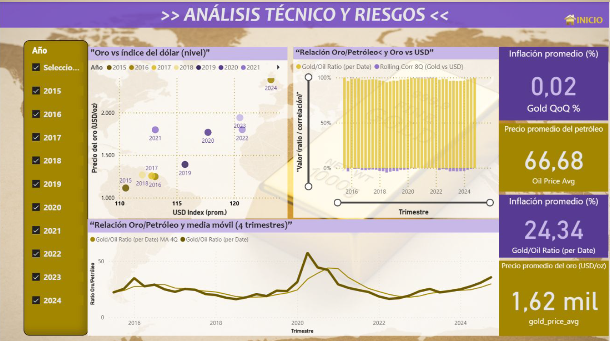
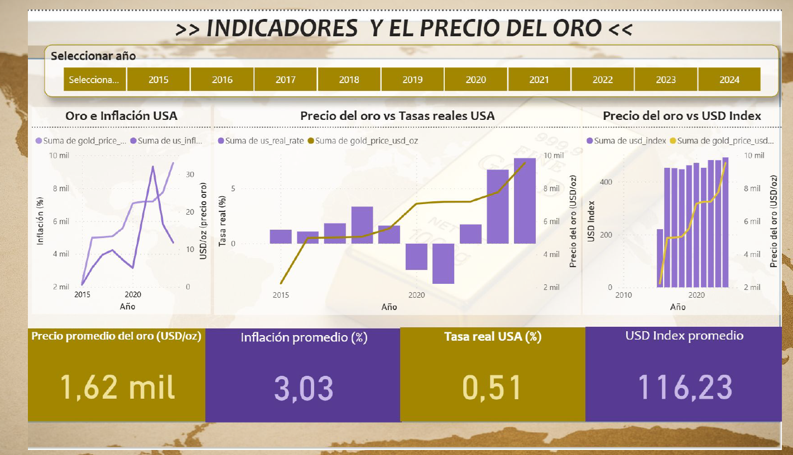
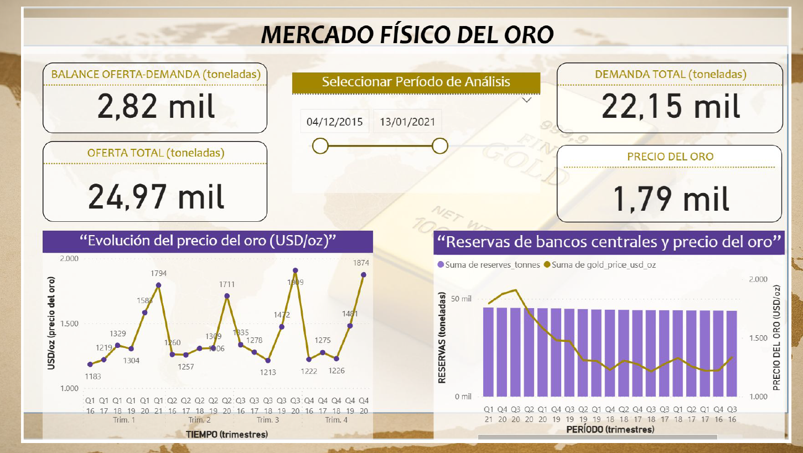

# 📘 Gold Market & Macroeconomic Analysis

> **> A comprehensive macro-financial analysis exploring the relationship between gold prices and global economic indicators through Python-based time-series analysis, multi-source data processing, and an executive Power BI dashboard.**

🧩 Problem Statement

Gold plays a dual role in the global economy:

As a commodity influenced by supply/demand fundamentals

As a financial asset used for hedging, diversification, and macro stabilization

However, gold’s behavior emerges from a complex interaction of variables:

Exchange rates

Inflation and real interest rates

Oil markets and commodity cycles

Central bank reserve policies

Geopolitical risk and liquidity regimes

This project develops a data-driven analytical framework to quantify these relationships and to explain how macroeconomic forces shape gold prices over time.

📌 Key Findings
1. Inverse USD–Gold Relationship

Strong long-term negative correlation (avg. ≈ –0.70)

Dollar depreciation reliably supports gold price rallies

During market stress, correlations weaken and can reverse

2. Gold as an Inflation & Real-Rate Hedge

Gold exhibits enhanced performance when real interest rates turn negative

CPI alone is an imperfect predictor—real rates have the highest explanatory power

Inflation shocks correspond to periods of structural upward repricing

3. Gold/Oil Ratio as a Macro Indicator

Long-term mean: ≈ 15–20 barrels per ounce

Ratios > 30 suggest overvaluation (or undervalued oil)

Useful for mean-reversion strategies during macro dislocations

4. Physical Market Constraints

Central banks have accumulated 400+ tonnes annually since 2010

Mining supply growth is structurally limited

Supply–demand balances highlight secular bullish pressure

📊 Features & Analysis
1. Technical Analysis & Risk Metrics

Gold vs USD Index

Rolling-window correlations

Gold/Oil ratio (moving average + reversion signals)

Volatility clustering and trend detection

Drawdown structure and risk conditions

*Figure 1 — Technical indicators and correlation dynamics*

2. Macroeconomic Drivers

Gold vs CPI (inflationary regimes)

Gold vs Real Rates (strongest predictive macro link)

USD strength (DXY multivariate impact)

Long-term cycles and structural breaks

*Figure 2 — Key macroeconomic variables shaping gold performance*

3. Physical Gold Market

Supply and demand components (mining, recycling, jewelry, investment)

Quarterly supply–demand balances

Central bank accumulation trends

Fundamental constraints affecting long-term pricing

*Figure 3 — Global physical gold market and reserve dynamics*

4. Power BI Dashboard

Executive dashboard designed to communicate macro-financial insights clearly

Gold price evolution and long-term trend behavior

Gold vs. USD Index, inflation, real rates, and oil market relationships

Volatility, drawdowns, and risk-condition monitoring

Business-oriented storytelling layer for financial reporting and decision support

🧠 Methodology
Data Collection

Sources: FRED, IMF, World Gold Council, World Bank

Coverage: 1990–2023 (33 years)

Frequency: Monthly & quarterly data

Preprocessing: standardization, missing-value handling, alignment

Statistical Techniques

Rolling-window correlation & betas

Trend decomposition & regression

Stationarity tests (ADF)

Ratio modeling (Gold/Oil, Gold/Silver)

Real vs nominal price transformations

Time-series feature engineering

Visualization & BI Dashboard

Python: Matplotlib, Seaborn, Plotly

Jupyter Notebooks for exploratory analysis and statistical modeling

Power BI dashboard for executive-level macro-financial storytelling

Interactive KPI views covering gold price dynamics, macro indicators, risk metrics, and market relationships

Publication-quality visualizations for analytical reporting

📁 Project Structure
gold-market-macroeconomic-analysis/
│
├── notebooks/
│   ├── 01_data_cleaning.ipynb
│   ├── 02_eda.ipynb
│   ├── 03_gold_vs_macro.ipynb
│   └── 04_final_plots.ipynb
│
├── data/
│   ├── raw/
│   └── processed/
│
├── img/
│   ├── 01-technical-analysis-gold-risks.png
│   ├── 02-macro-indicators-gold-price.png
│   └── 03-physical-gold-market.png
│
├── src/
├── docs/
├── example_usage.py
├── requirements.txt
└── README.md

⚙️ Getting Started
Clone the repository
git clone https://github.com/rAmIro-89/gold-market-macroeconomic-analysis.git
cd gold-market-macroeconomic-analysis

Create a virtual environment
python -m venv venv
source venv/bin/activate     # Windows: venv\Scripts\activate

Install dependencies
pip install -r requirements.txt

Run the notebooks
jupyter notebook notebooks/01_data_cleaning.ipynb

Or:

python example_usage.py

🧪 Skills Demonstrated

Macroeconomic time-series modeling

Financial data engineering

Advanced correlation & regression analysis

Power BI dashboard development

Business intelligence storytelling

Research-grade methodology

Python data science stack

Multi-source data integration

🚀 Future Enhancements

Machine learning models for gold forecasting

Automated data ingestion pipeline

Publish an online version of the Power BI dashboard

Automate Power BI data refresh from the Python pipeline

Add additional dashboard pages for portfolio allocation and scenario analysis

Extended geopolitical risk models (VIX, EPU Index)

Portfolio optimization using gold

📜 License

This project is licensed under the MIT License - see the [LICENSE](LICENSE) file for details.

---

## 📫 Contact

**Ramiro Ottone Villar**  
  

---

## 🙏 Acknowledgments

- **Federal Reserve Economic Data (FRED)** - US macroeconomic indicators
- **World Bank** - International economic data
- **World Gold Council (WGC)** - Gold market supply/demand statistics
- **International Monetary Fund (IMF)** - Global financial data

---

⭐ **If you find this analysis valuable, please consider starring the repository!**
